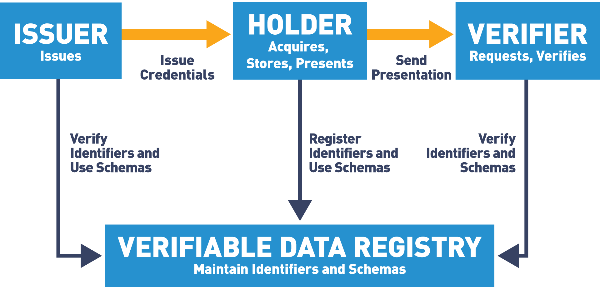
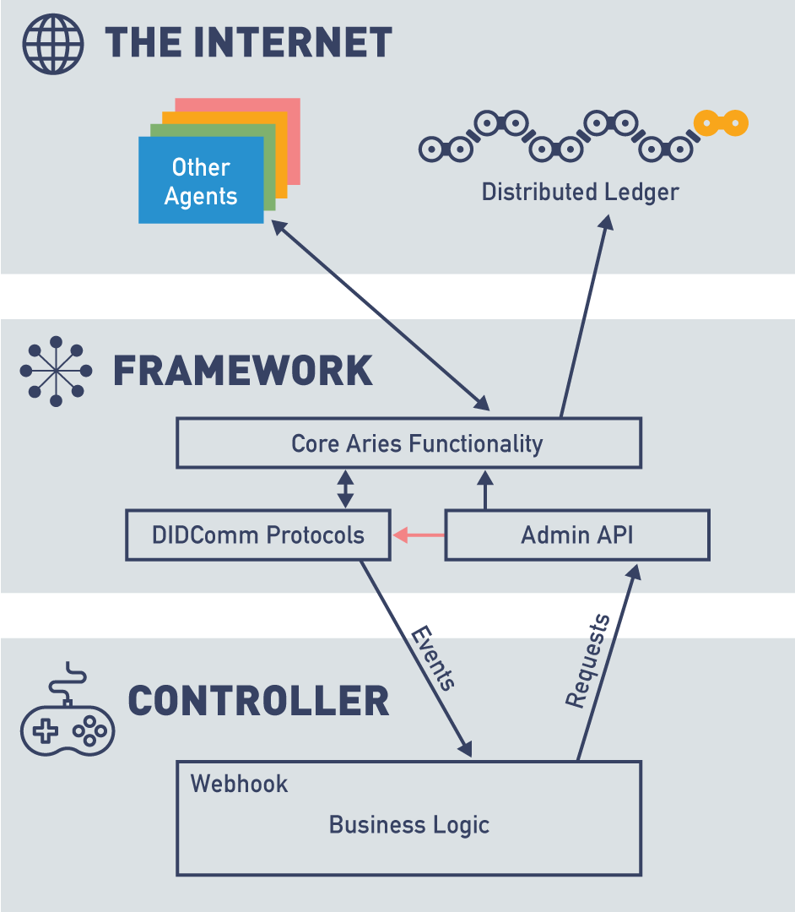
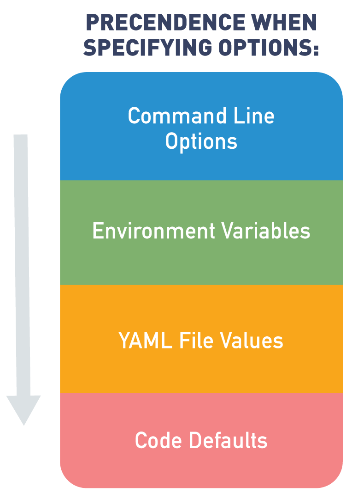
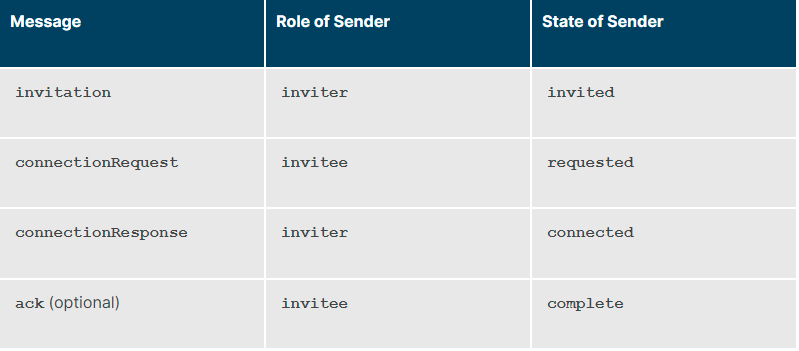
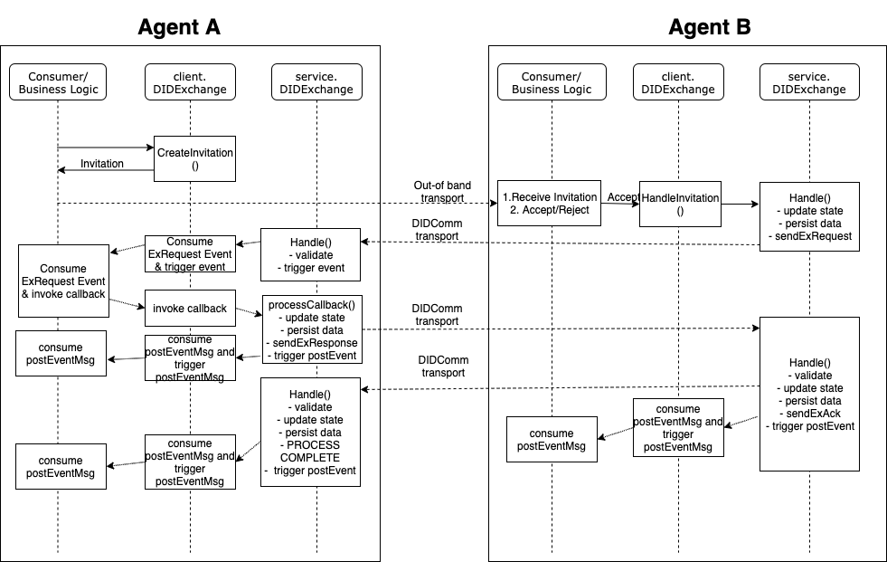

# Summary of LinuxFoundationX LFS173x: Becoming a Hyperledger Aries Developer

## Terminology

### Key terminologies
- **Verifiable Credential Model**
  - 
- **self-sovereign identity (SSI)**: SSI is the idea that you control your own data and you control when and how it is provided to others.
- **trust over IP**: Trust at the machine layer.
  - **aries in trust over ip**: Aries implements layer 2 (peer to peer), layer 1 (decentralized ids), and layer 3 (data exchange, including verifiable credentials).
- **decentralized identifiers**: a universally unique identifier (uuid) that is backed by a cryptographic key owned by the controller of the key.
- **zero-knowledge proofs**:  a cryptographic method of proving to someone that you know the value of an attribute without exposing the value of the attribute itself.
- **selective disclosure**: An issuer can put all of the claims that might be needed for a range of use cases, and the holder/prover and the verifier can limit the information shared for a specific presentation.
- **revocation**:  is the capability for an issuer to publish that an issued verifiable credential is no longer active. 
- **verifiable credential formats**: Any Aries agent that is built on Hyperledger Indy supports the Indy AnonCreds format.
- **secure storage**: Holds secrets for every Aries agent.
- **agent**: Software that interacts with other entities.

### Aries Ecosystem
1. Agents can be owned by the following
  - Large enterprises: [e.g. Land Transportation Office (LTO)] 
    - Will have public endpoints for other agents to use.
  - Small businesses: [e.g. Sole proprietorship businesses]
    - Can use 'Agency-as-a-Service' offered by vendors.
  - Mobile app: This will be a personal wallet.
  
2. **Verifiable data regisgtry**: Often implemented as a distributed ledger as the basis for issuing and presenting verifiable data. (e.g. https://indyscan.io/home/SOVRIN_MAINNET)

3. **Aries agent components**:
  - Framework: The framework contains the standard capabilities that enable an Aries agent to interact with its surroundings—ledgers, storage, verifiable credentials, presentations and other agents.
  - Controller: The controller is the component that controls the behaviour of an instance of an Aries framework—the business rules for that particular agent instance.
  - 

4. Aries community and standards
  - Aries RFCs (Request for comments): 
    - They describe important topics (not minor details) that the Hyperledger Aries wants to standardize across the Aries ecosystem.
    - https://github.com/hyperledger/aries-rfcs
  - Interoperability: Using a common set of protocols.
  - Aries Interop Profiles (AIP): Solution for the Aries community for Interoperability upon updates.
    - https://github.com/hyperledger/aries-rfcs/tree/main/concepts/0302-aries-interop-profile

### Aries current agent frameworks implementations
- Python: https://github.com/hyperledger/aries-cloudagent-python
- C#: https://github.com/hyperledger/aries-framework-dotnet
- GoLang: https://github.com/hyperledger/aries-framework-go
- Javascript (Typescript): https://github.com/hyperledger/aries-framework-javascript
- Rust: https://github.com/hyperledger/aries-vcx 

### Developer knowledge scope
- Developer: Needs to learn how to create controllers calling hyperledger indy blockchain.
- Infrastructure team: Needs to learn how to install and maintain that node.
- Open source project contributor: Needs to learn the developer details of the ledger project.
- Business team: Needs to learn use cases of different ledgers.
  
### Methods to take note of
1. did:web 
  - A non-ledger alternative for an organization to publish DIDs using their domain name’s DNS record.
  - https://w3c-ccg.github.io/did-method-web/
2. did:github 
  - A quick’n’dirty way to publish a DID for development purposes.
  - https://github.com/decentralized-identity/github-did/blob/master/docs/did-method-spec/index.md
3. did:orb 
  - uses a protocol called ActivityPub (and other technologies) to enable an entity to publish their DIDs in a trusted way without requiring a distributed ledger.
  - https://trustbloc.github.io/did-method-orb/

### Indy Genesis file
1. Genesis file: Contains information about the physical endpoints (IP addresses and ports) for some or all of the nodes in the ledger pool, as well as the cryptographic material necessary to securely communicate with those nodes.
  - Magic seed: `000000000000000000000000Trustee1`
    - Can be found at being generated in the following directory `/var/lib/indy/sandbox`
    - Resource: https://stackoverflow.com/questions/59089178/hypelerdger-indy-node-seed-value

### Hyperledger Aries 'Wallet'
1. indy wallet:
  - secure storage
  - agent's secure local storage, used to store DIDs, keys, ledg objects, and verifiable credentials.
  
2. aries wallet:
  - mobile agent application similar to a physical wallet holding money, verifiable ids, and important documents.

3. aries agent:
  - needs to know the location of the genesis file(s).
  - check if objects (e.g. DIDs, schemas) already exists in the secure storage, or create them if they don't
  - transport endpoints (e.g. HTTP, web sockets) for messaging other agents.
  - storage option for keys and other data.
  - Communication between agent framework and controller.

### Minimum agent requirement
1. The agent must know about things such as: 
- how to access a database for secure storage, 
- how to connect to a ledger, 
- how to interact with the controller.
  
2. Configuration format on CLI format: `--option <extra info>`
- for genesis file: `--genesis-file <genesis-file>`
- list options: `--help`

3. Other ways for coniguration:
- environment variable (e.g. ACAPY_GENESIS_FILE)
- yaml file:
```
# Use the Indy BCovrin Test genesis file:
genesis-file: http://test.bcovrin.vonx.io/genesis
```


4. ACA-Py operations:
- "start from scratch"  
  - "provision": to be used to establish a new wallet and ledger.
- "start with data" 
  - "start": used in normal operations, assume wallet and ledger are ok.

5. ACA-Py pstartup options: 
- Debug:
  - for development and debugging.
  - creates agents that can run without a separate controler. (implements default controller)
- Admin
  - configures ACA-Py endpoints to controller.
- General
  - configues and manages Python extensions, and non-indy objects.
- Ledger 
  - configures and connects agent to a ledger.
- Logging
  - configures where logs will reside.
- Mediation
  - configures ACA-Py agent being used as a mediator.
- Multi-tenant
  - configues ACA-Py agent to run in multi-tenant model.
  - one ACA-Py instance can serve as an agent for multiple entities.
- Protocal
  - handles different protocols.
- Start-up
  - options about profiles.
- Transport
  - configures the interface (e.g. HTTP, Websocket)
- Wallet
  - configures the storage. 
    - stores keys, DIDs, and Indy ledger.
	- type of database (e.g. SQLite, PostgreSQL), and credentials

### DIDComm protocol

- DIDComms can be routed through a configuration of mediator agents.
- DIDComm commonly use the did:peer DID method
  - Uses DIDs that are not published to a distributed ledger, but that are only shared privately between the communicating parties, usually just two agents.

1. Example DIDComm protocols:
- connection (DID Exchange) protocol: enables two agents to establish a connection through a series of messages.
- issue credential protocol: enables an agent to issue a credential to another agent.
- present proof protocol: enables an agent to request and receive a proof from another agent.

2. Protocol specifications:
- a series of messages
- one or more roles for the different participants
- a serie of named states for each roles
- a state machine per role that defines the states transitions triggered by messages/events


### Aries framework Go

Checking Aries framework Go for mobile agent.

- Aries Go connection framework
  - 
- Aries Go DIDComm layout
  - 
- Aries Go exchange flow
  - 

Resources:
- Build: https://github.com/hyperledger/aries-framework-go/blob/main/docs/test/build.md#Prerequisites-(for-running-tests-and-demos)
- [Skipped] Mobile agent: https://github.com/hyperledger/aries-framework-go/blob/main/cmd/aries-agent-mobile/README.md
- [Skipped] Aries framework go rest demo: https://github.com/hyperledger/aries-framework-go/blob/main/docs/rest/agent_docker.md
- Aries OpenAPI demo: https://github.com/hyperledger/aries-framework-go/blob/main/docs/rest/openapi_demo.md
- Main aries go repo: https://wiki.hyperledger.org/display/ARIES/aries-framework-go


Troubleshooting:
- Install Android Studio
  - android SDK path (Windows):  
    - More Actions > SDK Manager > Appearance & Behavior > System Setting > Android SDK

- Install 'Ubuntu' with `wsl2` on Windows machine
  - https://winaero.com/update-from-wsl-to-wsl-2-in-windows-10/ 
  - https://docs.docker.com/desktop/windows/wsl/#enabling-docker-support-in-wsl-2-distros

- `package github.com/golang/mock/mockgen@v1.5.0: can only use path@version syntax with 'go get'` error encountered. 
  - Update 'golang' to version 1.16+ in Ubuntu 20.04
    - https://stackoverflow.com/questions/42186003/how-to-uninstall-go
    - https://tecadmin.net/how-to-install-go-on-ubuntu-20-04/ 
      - Needs to export environment variables per session
	  ```
	  export GOROOT=/usr/local/go 
	  export GOPATH=$HOME/Projects/Proj1 
	  export PATH=$GOPATH/bin:$GOROOT/bin:$PATH 
	  ```

- `make: *** [Makefile:70: bdd-test-js] Error 127` error: 
  - **Fixed by installing NodeJS**
  - Install 'Node' using 'nvm'
    - https://heynode.com/tutorial/install-nodejs-locally-nvm/

- `Please, set "CHROME_BIN" env variable.` error encountered. 
  - 
  ```bash
  export CHROME_BIN="/mnt/c/Program Files/Google/Chrome/Application"
  ``` 
 
Archived (Not Used):
- `make command not found` on Windows 10 error encountered.
  -  Install 'make' in Windows. 
    - **Better to use Ubuntu WSL2, Windows has lots of path errors**
    - https://stackoverflow.com/questions/32127524/how-to-install-and-use-make-in-windows
  
- `package github.com/golang/mock/mockgen@v1.5.0: can only use path@version syntax with 'go get'` error encountered. 
  - **Fixed by updating Golang to 1.17**
  - https://stackoverflow.com/questions/54415733/getting-gopath-error-go-cannot-use-pathversion-syntax-in-gopath-mode-in-ubun
 
## Labs
  
## **Demo:** issuing, holding, proving, and verifying (For Android)
1. Mobile agent 
- Create and setup mobile agent
  - Download [Trinsic wallet](https://play.google.com/store/apps/details?id=id.streetcred.apps.mobile)
  - Create Trinsic wallet on mobile.
  - Click menu (hamburger icon on the upper left side of the screen)
  - Change 'network' to **'Sovrin Staging Network'**(This is a test network)

2. Issuer agent (https://email-verification.vonx.io/).

3. Issuer-Mobile agents connection request.
- **Issuer agent creates and sends a connection request**
  - Go to the following website `https://email-verification.vonx.io/`.
  - Input your email.
  - Click 'Submit'.
- **Mobile agent accepts connection request**
  - Verify email on email address provided.
  - After verifying email, you will be redirected to a website (e.g. https://email-verification.vonx.io/verify/[connection-id-here]/)
  - Scan the QR code using your Trinsic wallet on your phone.
  - You will get a pop up stating 'Email Verification Service has invited you to connect'.
  - Click 'Accept'. 

4. Issuer-Mobile agents credential offer.
- **Issuer agent creates credential offer.**
  - The website will then create a credential offer and send it to your mobile Trinsic wallet. (https://email-verification.vonx.io/in-progress/[connection-id-here]).
- **Mobile agent accepts credential offer.**
  - On you Trinsic mobile wallet on 'Actions' tab there should be a credential offer for a verified email.
  - Open 'Verified email'
  - Review the screen.
  - Click 'Accept'
- **Issuer agent logs mobile agent's acceptance of the offer**

5. Verifier agent (https://iiwbook.vonx.io/)

6. Verifier-Mobile agents connection request.
- **Verifier agent creates a connetion request**
  - Click 'Connect to Confbook'. A QR code will pop up.
- **Mobile agent accepts connection request**
  - Scan the QR code using your Trinsic wallet.
  - You will get a pop up stating 'ConfBook has invited you to connect'
  - Click 'Accept'

7. Verifier-Mobile agents proof of credentials.
- **Verifier agent creates a proof of credentials request**
  - The website will then create a proof of credentials request and send it to your mobile Trinsic wallet.
- **Mobile agent presents proof of credentials.**
  - On you Trinsic mobile wallet on 'Actions' tab there should be a request for proof of credentials.
  - Open 'BC Gov Verified Email'
  - Confbook should be asking for your email. 
  - Review the screen.
  - Click 'Present'

8. Verifier-Mobile agents credential offer.
- **Verifier agent creates and sends a credential offer**
  - After sending proof of credentials, you will be redirected to (https://iiwbook.vonx.io/submit-name/[connection-id-here])
  - Populate the following fields: Full name, Select a conference.
  - Click 'Submit'.
  - You will be redirected to the following page where verifier agent sent a credential offer. (https://iiwbook.vonx.io/in-progress/[connection-id-here])
- **Mobile agent accepts credential offer**
  - On you Trinsic mobile wallet on 'Actions' tab there should be a credential offer for a 'Conference Attendance'.
  - Open 'Conference Attendance'
  - Review the screen.
  - Click 'Accept'
- **Verifier agent logs mobile agent's acceptance of the offer**

9. Resources: Git demo and example on the following resources.
- https://github.com/cloudcompass/ToIPLabs/blob/main/docs/LFS173xV2/IssuingHoldingProving.md
- https://www.youtube.com/watch?v=9WZxlrGMA3s

## **Demo:** Connecting two local agents

### Pre-requsite
- CLI (git-bash)
- Docker
- Git

### Environment setup
1. Starting the Von network: This will act as a local 'verifiable data regisgtry'\
  - Open a new 'git-bash' CLI.
  - Clone the git repository for von-network.
  ```bash
  git clone https://github.com/bcgov/von-network
  ```
  - Navigate to the von-network directory
  ```bash
  cd von-network
  ```
  - Build von-network
  ```bash
  ./manage build
  ```
  - Run a Docker instance of von-network
  ```bash
  ./manage start --logs
  ```
  - Resource: https://github.com/bcgov/von-network/blob/main/docs/UsingVONNetwork.md#building-and-starting

2. Run Agents
  - Open a new 'git-bash' CLI.
  - Clone the git repository for aries-cloudagent-python.
  ```bash
  git clone https://github.com/hyperledger/aries-cloudagent-python
  ```
  - Navigate to demo directory
  ```bash
  cd aries-cloudagent-python/demo
  ```

3. Run user agent (Alice)
  ```bash
  LEDGER_URL=http://dev.greenlight.bcovrin.vonx.io ./run_demo alice
  ```

4. Run issuer agent (Faber College)
  - Open a new 'git-bash' CLI.
  ```bash
  LEDGER_URL=http://dev.greenlight.bcovrin.vonx.io ./run_demo faber
  ```
  - For AIP2.0, you can use the following command
  ```bash
  LEDGER_URL=http://dev.greenlight.bcovrin.vonx.io ./run_demo faber --did-exchange --aip 20
  ```
  - Resource:
    - https://github.com/hyperledger/aries-cloudagent-python/tree/main/demo#the-alicefaber-python-demo
	- https://github.com/cloudcompass/ToIPLabs/blob/main/docs/LFS173xV2/agentsConnectingAIP2.md

### Running the agents
1. Connecting the agents.
- **Issuer agent (Faber) creates a connection request**
  - This will automatically be done upon starting issuer agent.
  - 'Faber' agent will generate the following:
    - Invitation data
	- QR Code
  - Take note of the invitation data, it would look similar to this.
  ```json
  {"@type": "https://didcomm.org/out-of-band/1.0/invitation", "@id": "d4169abe-4dfd-49fc-bdb1-f007c8258d46", "services": [{"id": "#inline", "type": "did-communication", "recipientKeys": ["did:key:z6MkneMK93pm4bd3w7ZLdUvi7e7pg1xq9KXHkE5ygMTfSQ2P"], "serviceEndpoint": "http://host.docker.internal:8020"}], "label": "faber.agent", "handshake_protocols": ["https://didcomm.org/didexchange/1.0"]}
  ```
- **User agent (Alice) accepts a connection request**
  - On 'Alice' agent CLI, there would be a field 'Invite details:'
  - Input invitation data from 'Faber' agent. (Must be one line with no 'new lines')

2. Interact between the agents.
  - You can use the option '(3) Send Message' on both Issuer (Faber), and User (Alice) agents.

3. On Issuer agent (Faber), you have additional options
  - (1) Issue Credential: Issues a credential to user agent (Alice).
  - (2) Send Proof Request: Asks for proof of credentials from user agent (Alice).
  - (4) Create New Invitation: Create new invitation (connection request).
  
- Resource: https://github.com/cloudcompass/ToIPLabs/blob/main/docs/LFS173xV2/agentsConnecting.md
  
## **Demo:** Von Network

### Pre-requsite
- CLI (git-bash)
- Docker
- Git

### Environment setup
1. Starting the Von network: This will act as a local 'verifiable data regisgtry'\
  - Open a new 'git-bash' CLI.
  - Clone the git repository for von-network.
  ```bash
  git clone https://github.com/bcgov/von-network
  ```
  - Navigate to the von-network directory
  ```bash
  cd von-network
  ```
  - Build von-network
  ```bash
  ./manage build
  ```
  - Run a Docker instance of von-network
  ```bash
  ./manage start --logs
  ```

### Use the VON Network
1. Navigate to the webserver: http://localhost:9000
  
2. Browse the ledger

3. View the ledger transactions
  - Domain: List of ledger transactions (DID, scheme, etc.).
  - Pool: List of running nodes.
  - Config: List of changes to the network configurations.
	
4. Create a DID
  - On the homepage, check 'Authenticate a New DID widget'
    - Choose 'Register from seed'
    - 'Wallet Seed' field: Type your first name.
    - 'Alias' field: Type your full name.
    - Click 'Register DID'.  
	  
5. View the ledger transactions again and find the newly created DID
  - Navigate to 'Domain', then go to the last transaction.
	
6. View the ledger genesis file
  -  From the main menu of the Ledger Browser
  - Click on the “Genesis Transaction” link to see the genesis file for the network.
    - Check connection from genesis transaction to ledger.
  - Get the value of 'from' from genesis transaction json file
    - Navigate to 'Domain', then search for the same value on the ledger.
  
7. Stop and remove the network
  - To delete the whole network and data of the ledger.
  ```bash
  ./manage down
  ```
  - To stop WITHOUT deleting data.
  ```bash
  ./manage stop
  ```
  
- Resource: https://github.com/cloudcompass/ToIPLabs/blob/main/docs/LFS173xV2/vonNetwork.md  

## **Demo:** Resolving DIDs Universally

1. Go to DIF Resolver website: https://dev.uniresolver.io/
  - If planning on running own instance source codes can be found here: https://github.com/decentralized-identity/universal-resolver/

2. Click on the orange warning icon on the top left of the page and read the caveats

3. Check an example DID from the Sovrin Foundation `did:sov`
  - Input `did:sov:7Tqg6BwSSWapxgUDm9KKgg` to the 'did-url' bar.
  - Click 'Resolve'
  - DID should be found in the Sovrin mainnet: 
    - Can be with the 'Target DID' key: https://indyscan.io/tx/SOVRIN_MAINNET/domain/54474
	- Only `7Tqg6BwSSWapxgUDm9KKgg` can be seen in indyscan, because [Sovrin DID Method](https://sovrin-foundation.github.io/sovrin/spec/did-method-spec-template.html) defines how to transform a Sovrin MainNet DID into a DIDDoc on Sovrin mainnet.

4. Check an example DID for the web `did:web`
  - Input `did:web:did.actor:alice` to the 'did-url' bar.
    - 'did:web': It works for an entity with a DNS entry including it in the DID after did:web.
	- The full DIDDoc for the DID resides at the location `https://<dns>/<did>/did.json`. (e.g. https://did.actor/alice/did.json)
  - Click 'Resolve'
 
6. Other common DID methods:
  - 'did:github': a DID linked to a Github account (e.g. did:github:gjgd)
  - 'did:btcr': a DID on the Bitcoin ledger
  - 'did:erc725': a DID on the Ethereum ledger
  - 'did:ethr': another DID method using the Ethereum ledger
  - 'did:ion': a DID rooted in the Bitcoin ledger using Microsoft's DID Method
  - 'did:ipid': a DID based on the IPFS "Interplanetary File System"
  - 'did:key': a DID not on a ledger, just a public key wrapped in the DID itself

- Resource: https://github.com/cloudcompass/ToIPLabs/blob/main/docs/LFS173xV2/didResolvers.md


## **Demo:** Agent Startup Options
1. Check ACA-Py version.
```bash
scripts/run_docker --version
```
  - Error encountered: docker: invalid reference format: repository name must be lowercase.
    - Solution: On line 40 on `run_docker` file, temporarily remove ARGS, since it contains uppercase symbols on Windows.
	```
	# ARGS="${ARGS} -v $(pwd)/../logs:/home/indy/logs"
    ARGS=""
    ```

2. Check ACA-Py options.
```bash
scripts/run_docker --help
```

3. Check ACA-Py provision options.
```bash
scripts/run_docker provision --help
```

4. Check ACA-Py start options.
```bash
scripts/run_docker start --help
```
- Resource: 
  - https://github.com/cloudcompass/ToIPLabs/blob/main/docs/LFS173xV2/ACA-PyStartup.md
  - https://github.com/hyperledger/aries-cloudagent-python/blob/main/DevReadMe.md#configuring-aca-py-command-line-parameters
  
## **Demo:** Alice Controller

### Alice gets a credential
- Resource: https://github.com/cloudcompass/ToIPLabs/blob/main/docs/LFS173xV2/AliceGetsCredential.md

### OpenAPI introduction
- Resource: https://github.com/cloudcompass/ToIPLabs/blob/main/docs/LFS173xV2/OpenAPIIntroduction.md
  
## **Demo:** Running mobile agent go framework
1. Setup environment. (For Windows 10)[Check Aries framework Go > Troubleshooting for in depth instructions]
  - On Windows:
    - Download and install Docker Desktop
    - Download and install Ubuntu
    - Configure Ubuntu with WSL2
    - Link Ubuntu to Docker Desktop through WSL2  
	- Launch Ubuntu
  - On Ubuntu:  
    - Install go version 1.16+
	```bash
	sudo apt update
	sudo apt install golang
	```
	  - Check if installation is successful
	  ```bash
	  go version
	  ```
	- Install 'node' through 'nvm'
	```bash
	wget -qO- https://raw.githubusercontent.com/nvm-sh/nvm/v0.39.1/install.sh | bash
	export NVM_DIR="$([ -z "${XDG_CONFIG_HOME-}" ] && printf %s "${HOME}/.nvm" || printf %s "${XDG_CONFIG_HOME}/nvm")"[ -s "$NVM_DIR/nvm.sh" ] && \. "$NVM_DIR/nvm.sh" # This loads nvm
	```
	  - Open a new Ubuntu window, and verify 'nvm' installation
	  ```bash
	  command -v nvm
	  ```
	  - Install 'node' using 'nvm'
	  ```bash
	  nvm install --lts
	  ```
	  - Verify if 'node' has been installed
	  ```bash
	  node --version
	  ```
	- Install 'make'
	```bash
	sudo apt update
	sudo apt install make
	```
	  - Verify if 'make' has been installed
	  ```bash
	  make -version
	  ```
	- Set environment variables
    ```bash
  	export GOROOT=/usr/local/go 
	export PATH=$GOPATH/bin:$GOROOT/bin:$PATH 
	export CHROME_BIN="/mnt/c/Program Files/Google/Chrome/Application"
    ```

2. Clone 'aries-framework-go'
```bash
git clone https://github.com/hyperledger/aries-framework-go.git
```
- Go in the directory
```bash
cd aries-framework-go
```

3. [Skipped] Run 'make' command
```bash
make all
```
- Error encountered: Chrome test failed, due to not being responsive.
  - **Skipped for now**
  
4. Build local rest agent.
```bash
make agent-rest-docker
``` 

5. [Skipped] Run container. 
```bash
docker run aries-framework-go/agent-rest start [flags]
```
- `Error: Neither api-host (command line flag) nor ARIESD_API_HOST (environment variable) have been set.` error encountered
  - Solution: Run the follwing template **(Not yet fully working)**
  ```bash
  docker run aries-framework-go/agent-rest start --api-host localhost:8080 --database-type mem --inbound-host http@localhost:8081,ws@localhost:8082 --inbound-host-external http@https://example.com:8081,ws@ws://localhost:8082 --webhook-url localhost:8082 --agent-default-label MyAgent
  ```
  
6. Run Swagger API container
```bash
make run-openapi-demo
```
- Access Alice OpenAPI `http://localhost:8089/openapi/`
- Access Bob OpenAPI `http://localhost:9089/openapi/`

- Tested did-exchange 
  - GET `/connections`: Error encountered cannot fetch
    - Solution: Manually went to `https://localhost:8082/connections`, and accepted certificate.

## Resources
- https://github.com/cloudcompass/ToIPLabs/blob/main/docs/LFS173x

