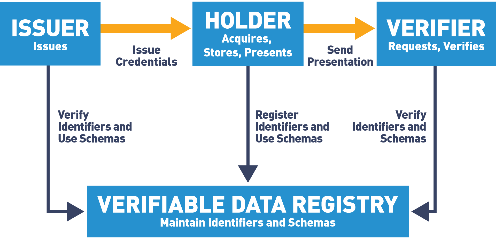

# Summary of LinuxFoundationX LFS173x: Becoming a Hyperledger Aries Developer

## Terminology
- **Verifiable Credential Model**
  - 
- **self-sovereign identity (SSI)**: SSI is the idea that you control your own data and you control when and how it is provided to others.
- **trust over IP**: Trust at the machine layer.
  - **aries in trust over ip**: Aries implements layer 2 (peer to peer), layer 1 (decentralized ids), and layer 3 (data exchange, including verifiable credentials).
- **decentralized identifiers**: a universally unique identifier (uuid) that is backed by a cryptographic key owned by the controller of the key.
- **zero-knowledge proofs**:  a cryptographic method of proving to someone that you know the value of an attribute without exposing the value of the attribute itself.
- **selective disclosure**: An issuer can put all of the claims that might be needed for a range of use cases, and the holder/prover and the verifier can limit the information shared for a specific presentation.
- **revocation**:  is the capability for an issuer to publish that an issued verifiable credential is no longer active. 
- **verifiable credential formats**: Any Aries agent that is built on Hyperledger Indy supports the Indy AnonCreds format.
- **secure storage**: Holds secrets for every Aries agent.
- **agent**: Software that interacts with other entities.

## Labs

### Pre-requsite
- CLI (git-bash)
- Docker
- Git

### Demo: issuing, holding, proving, and verifying (For Android)
1. Mobile agent 
- Create and setup mobile agent
  - Download [Trinsic wallet](https://play.google.com/store/apps/details?id=id.streetcred.apps.mobile)
  - Create Trinsic wallet on mobile.
  - Click menu (hamburger icon on the upper left side of the screen)
  - Change 'network' to **'Sovrin Staging Network'**(This is a test network)

2. Issuer agent (https://email-verification.vonx.io/).

3. Issuer-Mobile agents connection request.
- **Issuer agent creates and sends a connection request**
  - Go to the following website `https://email-verification.vonx.io/`.
  - Input your email.
  - Click 'Submit'.
- **Mobile agent accepts connection request**
  - Verify email on email address provided.
  - After verifying email, you will be redirected to a website (e.g. https://email-verification.vonx.io/verify/[connection-id-here]/)
  - Scan the QR code using your Trinsic wallet on your phone.
  - You will get a pop up stating 'Email Verification Service has invited you to connect'.
  - Click 'Accept'. 

4. Issuer-Mobile agents credential offer.
- **Issuer agent creates credential offer.**
  - The website will then create a credential offer and send it to your mobile Trinsic wallet. (https://email-verification.vonx.io/in-progress/[connection-id-here]).
- **Mobile agent accepts credential offer.**
  - On you Trinsic mobile wallet on 'Actions' tab there should be a credential offer for a verified email.
  - Open 'Verified email'
  - Review the screen.
  - Click 'Accept'
- **Issuer agent logs mobile agent's acceptance of the offer**

5. Verifier agent (https://iiwbook.vonx.io/)

6. Verifier-Mobile agents connection request.
- **Verifier agent creates a connetion request**
  - Click 'Connect to Confbook'. A QR code will pop up.
- **Mobile agent accepts connection request**
  - Scan the QR code using your Trinsic wallet.
  - You will get a pop up stating 'ConfBook has invited you to connect'
  - Click 'Accept'

7. Verifier-Mobile agents proof of credentials.
- **Verifier agent creates a proof of credentials request**
  - The website will then create a proof of credentials request and send it to your mobile Trinsic wallet.
- **Mobile agent presents proof of credentials.**
  - On you Trinsic mobile wallet on 'Actions' tab there should be a request for proof of credentials.
  - Open 'BC Gov Verified Email'
  - Confbook should be asking for your email. 
  - Review the screen.
  - Click 'Present'

8. Verifier-Mobile agents credential offer.
- **Verifier agent creates and sends a credential offer**
  - After sending proof of credentials, you will be redirected to (https://iiwbook.vonx.io/submit-name/[connection-id-here])
  - Populate the following fields: Full name, Select a conference.
  - Click 'Submit'.
  - You will be redirected to the following page where verifier agent sent a credential offer. (https://iiwbook.vonx.io/in-progress/[connection-id-here])
- **Mobile agent accepts credential offer**
  - On you Trinsic mobile wallet on 'Actions' tab there should be a credential offer for a 'Conference Attendance'.
  - Open 'Conference Attendance'
  - Review the screen.
  - Click 'Accept'
- **Verifier agent logs mobile agent's acceptance of the offer**

9. Resources: Got demo and example on the following resources.
- https://github.com/cloudcompass/ToIPLabs/blob/main/docs/LFS173xV2/IssuingHoldingProving.md
- https://www.youtube.com/watch?v=9WZxlrGMA3s

## Aries Infrastructure

## Resources
- https://github.com/cloudcompass/ToIPLabs/blob/main/docs/LFS173x