# Pre-requisites
- [VSCode](https://code.visualstudio.com/)
- [NodeJS](https://nodejs.dev/download/)
- [Git](https://git-scm.com/downloads)
- [Metamask](https://metamask.io/)

# Steps in learning Solidity

## Setup environment
1. Create Metamask wallet, and back up the 12 key mnemonic.
2. Add test ether to 'Rinkeby Testnet' using this [faucet](https://faucets.chain.link/rinkeby).
3. Navigate to [Ethereum Remix IDE](https://remix.ethereum.org/) on your browser.
4. Create new contract 'SimpleStorage.sol'. Follow this tutorial [here](https://docs.soliditylang.org/en/v0.8.13/introduction-to-smart-contracts.html)
```javascript
// SPDX-License-Identifier: GPL-3.0
pragma solidity >=0.4.16 <0.9.0;

contract SimpleStorage {
    uint storedData;

    function set(uint x) public {
        storedData = x;
    }

    function get() public view returns (uint) {
        return storedData;
    }
}
```
## Reverse engineer the source code
5. Analyze and remake, what the codes do line per line.
- First line is the license specifier. This is important when publishing the source code.
```javascript
// SPDX-License-Identifier: GPL-3.0
```
- Import Solidity with the following line.
	- [pragma](https://docs.soliditylang.org/en/v0.8.13/layout-of-source-files.html#pragma): Enables certain compiler checks.
	- solidity >=0.4.16 <0.9.0: Declares that the source code is written for Solidity 0.4.16, but not including versions Solidity 0.9.0 onwards.
```javascript
pragma solidity >=0.4.16 <0.9.0;
```
- Declare initial contract: This has similar struture to Javascript ES6 classes.
	- contract: The source code type, which is similar to Javascript ES6 class.
	- SimpleStorage: The name of the contract.
```javascript
contract SimpleStorage {

}
```
- Declare initial variable.
	- uint: variable type ['unigned integer'](https://docs.soliditylang.org/en/v0.8.12/types.html#integers).
	- storeData: variable name.
```javascript
uint storedData;
```
- Declare 'set' function: Set data to 'storeData' in the smart contract.
- function set: Create a function called 'set'.
- (uint x): Parameter of set function, taking in a 'uint' variable type, and placing it on variable name 'x' for the function to use.
- public: Instatiating function with 'public' visibility so everyone can access this function. 
	- More info about 'visibility and getters' can be found [here](https://docs.soliditylang.org/en/v0.8.13/contracts.html#visibility-and-getters) for other types.
```javascript
function set(uint x) public {
}
```
- Add setter inside 'set' function.
	- 'storedData' global variable is assigned 'x' by function 'set'.
```javascript
storedData = x;
```
- Declare 'get' function: used to view the stored data on the smart contract.
	- function get: Create a function called 'get'.
	- public
	- [view](https://docs.soliditylang.org/en/v0.8.13/contracts.html#view-functions): Promises that this function would not be able to append any data on the blockchain.
		- More info about state mutability can be found [here](https://docs.soliditylang.org/en/v0.8.13/contracts.html#state-mutability)
	- [returns (uint)](https://docs.soliditylang.org/en/v0.8.13/contracts.html#return-variables): Declares expected values to be returned by the function. (For this case a 'uint' data variable)
```javascript
function get() public view returns (uint) {
}
```
- Add a return statement inside 'get' function.
	- returns the 'uint' global varibale 'storedData'.
```javascript
return storedData;
```
## Deploy smart contract to Rinkeby test net
6. Deploy 'SimpleStorage.sol' contract with Remix.
- Navigate to 'compile' on the left tab. (3rd icon)
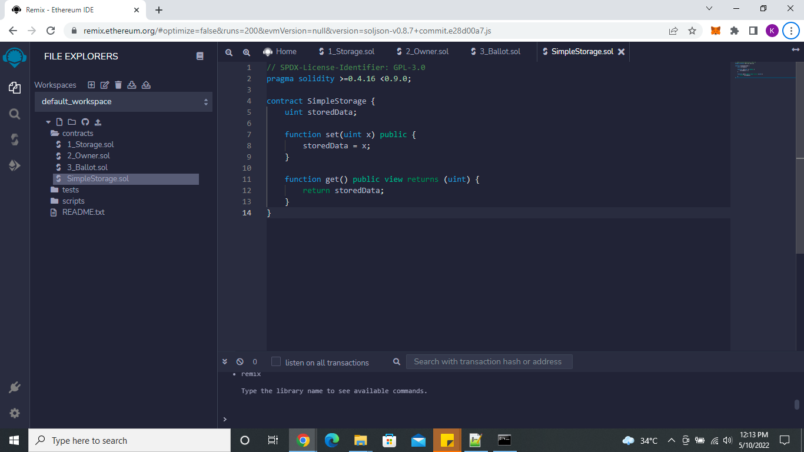
- Click 'Compile SimpleStorage.sol'.
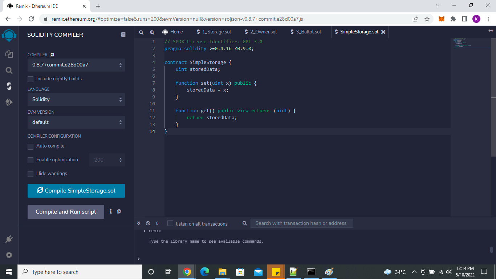
- Contract will be compiled and displayed below.
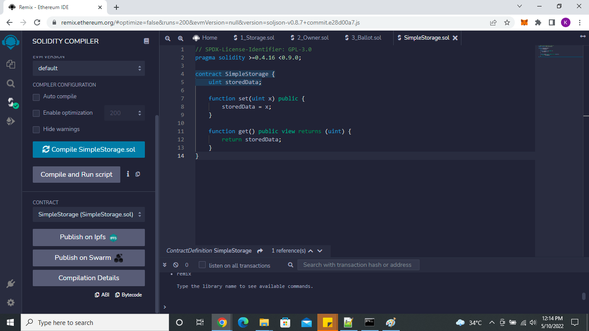
- Checking 'Compilation Details' would show imporatant data like 'ABI' and 'Bytecode'. (These are used for deploying the smart contract to the blockchain)
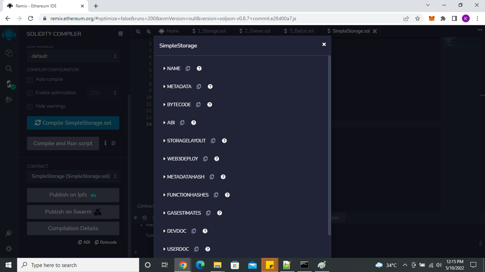
- Navigate to 'deploy' on the left tab (4th icon)
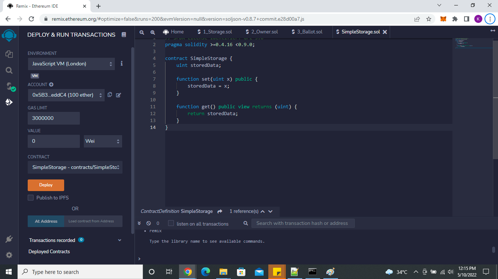
- Change 'Environment' to 'Injected Web3'. Your Metamask wallet should pop up.
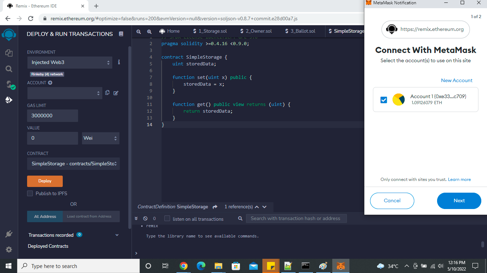
- Click on 'Next' then 'Confirm' on the Metamask wallet.
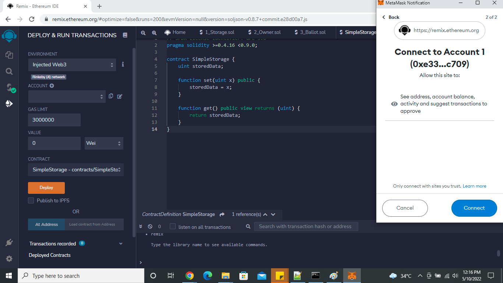
- Click 'Confirm' on the next page, this pays gas fee to the ethereum blockchain, so your transaction would take place (Think of it as a service charge from the bank)
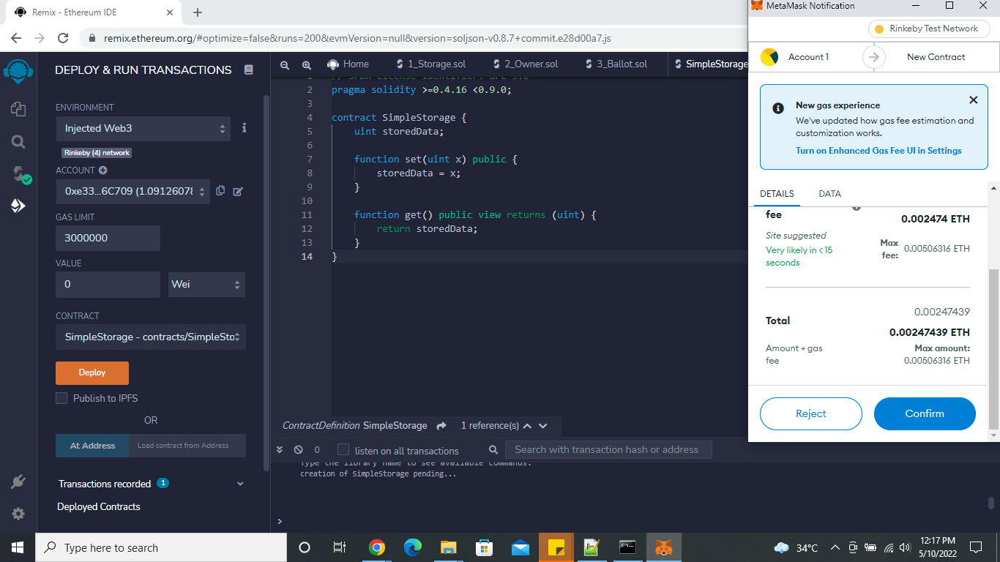
- On your Metamask wallet, go to the 'Activity' tab, and you should see your transaction.
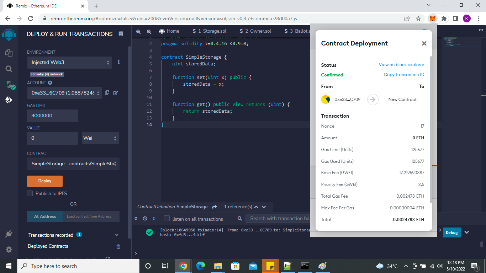

- My deployed contract can be found [here](https://rinkeby.etherscan.io/tx/0xa97a84e5122dbc52b20622a4c7381fbc5e882406a2acc2c49b8e46bba80e2777)

## Interacting with the contract
7. Get data from the SimpleStorage contract.
- Click get, and you should see the following result.
	- It gives a `0` because it was not initialized, and 'uint' data types default value is `0`.
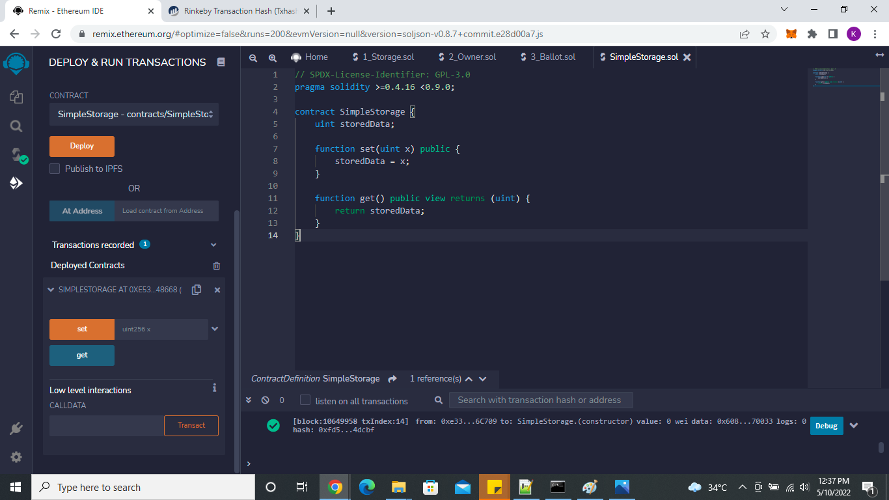
8. Set data to the SimpleStorage contract.
- Input an positive integer, then click 'set'.
- Click 'Confirm' and pay gas fee on Metamask wallet prompt.
	- There is a prompt for 'set' function because we are changing data on the smart contract, and it takes a small fee to process the transaction.
	- My transaction can be found [here](https://rinkeby.etherscan.io/tx/0xe26b22e38c001046906f11cc79aec9d876fe861d762ff037ab5e0232d73d20a7).
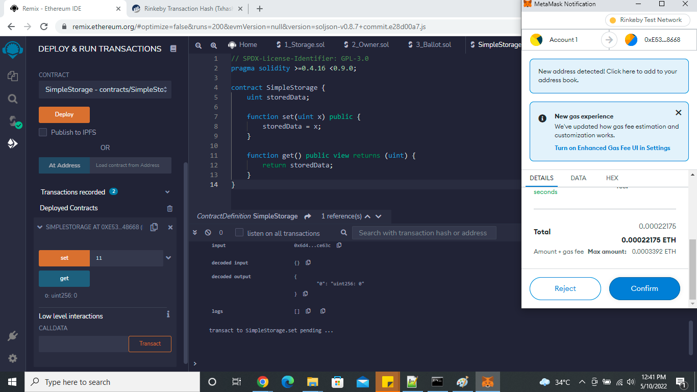
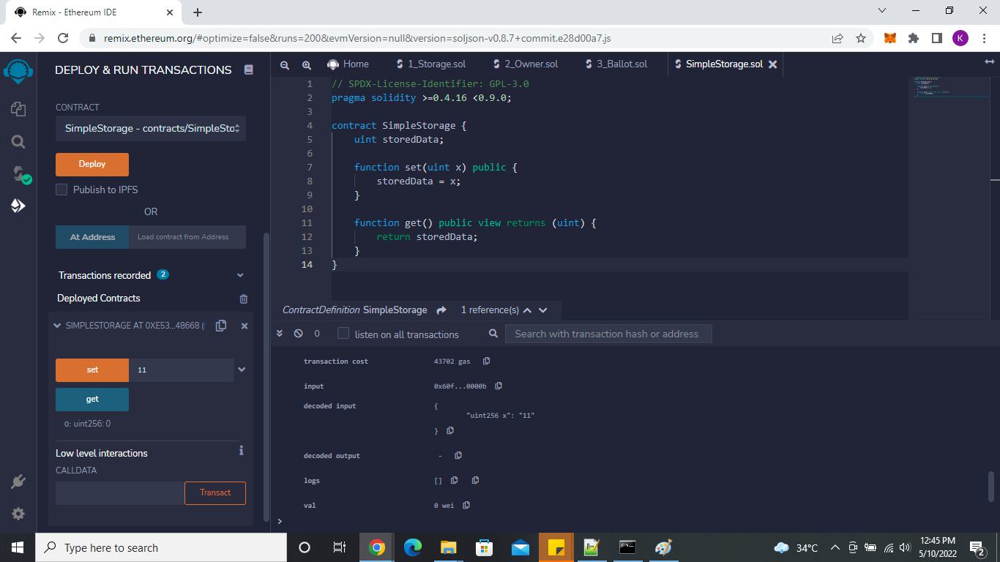
7. Get data again from the SimpleStorage contract.
- Click get, and you should see the following result.
	- It gives a `11` because it is now initialized.
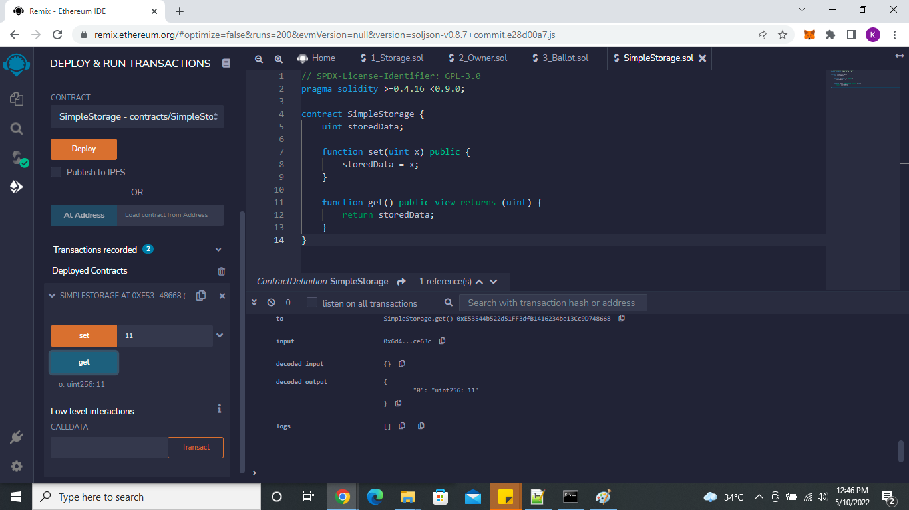

# Developing a sub currency.

1. Reverse engineering a more advanced Solidity source code found [here](https://docs.soliditylang.org/en/v0.8.13/introduction-to-smart-contracts.html#subcurrency-example)
- In Remix, create new Solidity contract called 'Coin.sol'.
```javascript
// SPDX-License-Identifier: GPL-3.0
pragma solidity ^0.8.4;

contract Coin {
    // The keyword "public" makes variables
    // accessible from other contracts
    address public minter;
    mapping (address => uint) public balances;

    // Events allow clients to react to specific
    // contract changes you declare
    event Sent(address from, address to, uint amount);

    // Constructor code is only run when the contract
    // is created
    constructor() {
        minter = msg.sender;
    }

    // Sends an amount of newly created coins to an address
    // Can only be called by the contract creator
    function mint(address receiver, uint amount) public {
        require(msg.sender == minter);
        balances[receiver] += amount;
    }

    // Errors allow you to provide information about
    // why an operation failed. They are returned
    // to the caller of the function.
    error InsufficientBalance(uint requested, uint available);

    // Sends an amount of existing coins
    // from any caller to an address
    function send(address receiver, uint amount) public {
        if (amount > balances[msg.sender])
            revert InsufficientBalance({
                requested: amount,
                available: balances[msg.sender]
            });

        balances[msg.sender] -= amount;
        balances[receiver] += amount;
        emit Sent(msg.sender, receiver, amount);
    }
}
```
## Reverse engineer the source code
2. Analyze and remake, what the codes do per line or block.
- Add license header, and Solidity compiler version.
```javascript
// SPDX-License-Identifier: GPL-3.0
pragma solidity ^0.8.4;
```
- Declare contract called 'Coin': This will be used to mint, and send tokens.
```javascript
contract Coin {

}
```